### SA_Week06_NguyenLeMyChau_20046631

#### Mô tả
Client thông qua ứng dụng gửi thông tin đặt hàng sau khi chọn lựa. Thông tin này được chuyển về dạng json và được mã hóa Base64

Để tăng hiệu suất xử lý, hệ thống sử dụng messaging service cho việc lắng nghe việc đặt hàng. Khi nhận được đơn
hàng từ client, hệ thống sẽ kiểm tra số lượng trong kho có đủ không, sau đó quyết định đơn hàng có được xác nhận hay không.
Cho dù xác nhận hay hủy bỏ, hệ thống cũng sẽ gửi một email đến khách hàng để thông báo tình hình.

#### Sử dụng
- JDK: Phiên bản 17.0.10
- Java Spring Boot
- Gradle Groovy
- MariaDB
- ActiveMQ 6.1.1

#### Công cụ

#### Config

Config ActiveMQ:
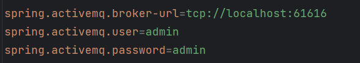

Config MariaDB:
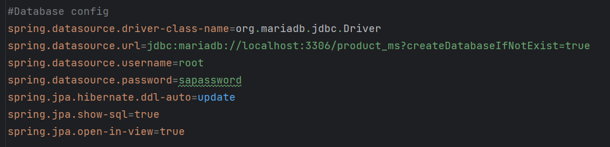

Config SendEmail:
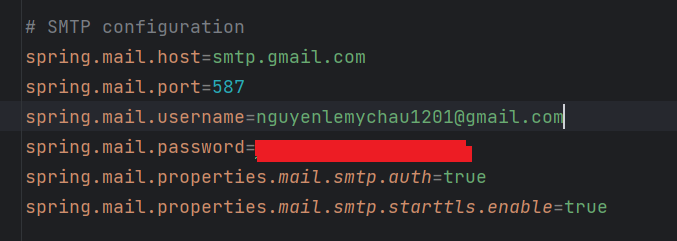

#### Queue
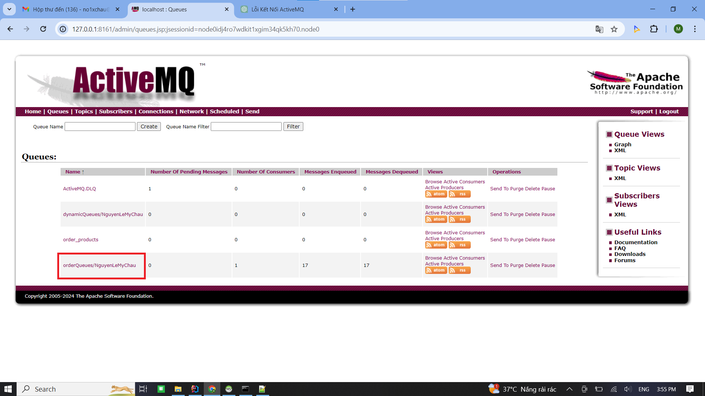

#### Sender Order
Tạo kết nối đến ActiveMQ --> Tạo session --> Tạo queue --> Tạo producer

Sau đấy tạo List OrderDetail với mỗi OrderDetail có các field quantity, price, order, product

Trong orderServices, tạo một hàm insertOrderDetail nhận một List OrderDetail, sử dụng phương thức convertListOrderDetail2Json để chuyển danh sách này thành định dạng JSON. 
Kết quả JSON sau đó được mã hóa bằng phương thức base64EncodingText.encrypt.
Cuối cùng, hàm trả về chuỗi đã được mã hóa.

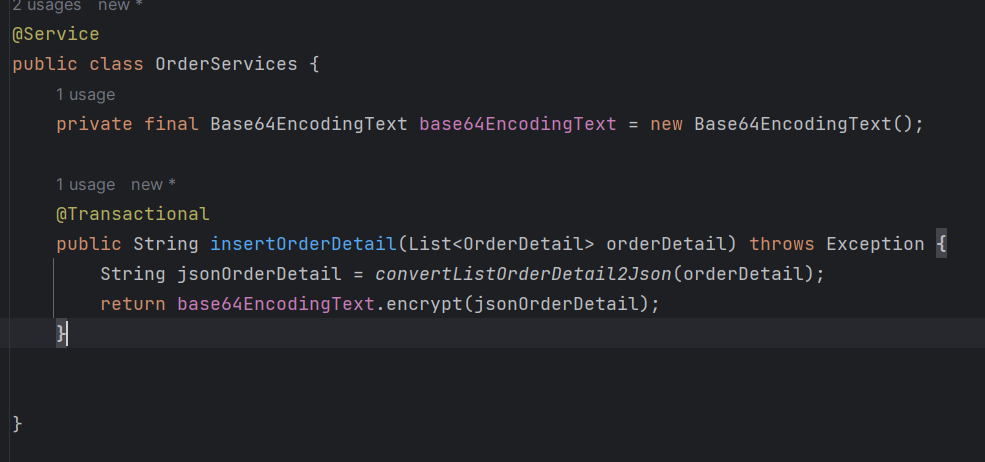

Sau khi có được chuỗi mã hoá, tạo TextMessage để gửi thông điệp đến Queue đã được cấu hình

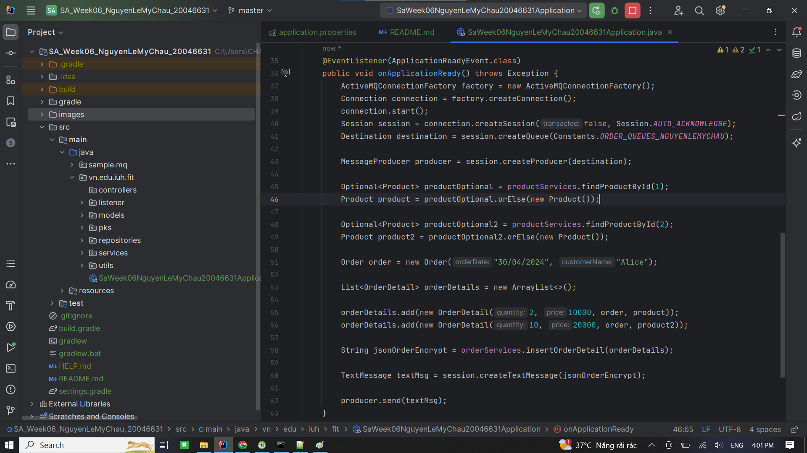

#### Receiver Order
Sau khi nhận được TextMessage do Sender gửi đến, Receiver tiến hành đọc Message và giải mã Message bằng phương thức base64EncodingText.decrypt
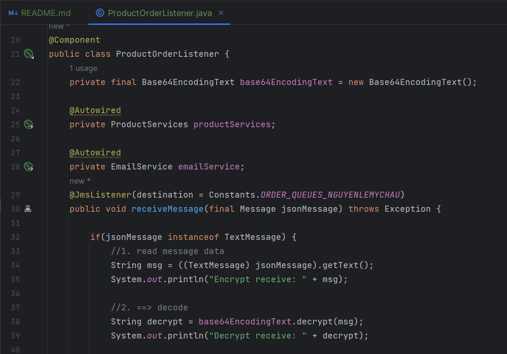

Mã hoá và giải mã message:

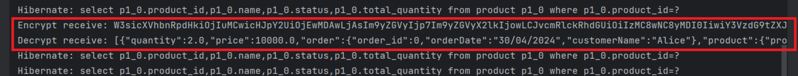

Sau khi giải mã và convert từ JSON về List OrderDetail, kiểm tra số lượng trong kho có đủ không cho từng sản phẩm, nếu có bất kỳ sản phẩm nào không đủ thì đều từ chối đơn hàng và gửi email cho khách hàng biết. Tương tự, nếu đơn hàng thaành công thì gửi email thông báo cho khách hàng
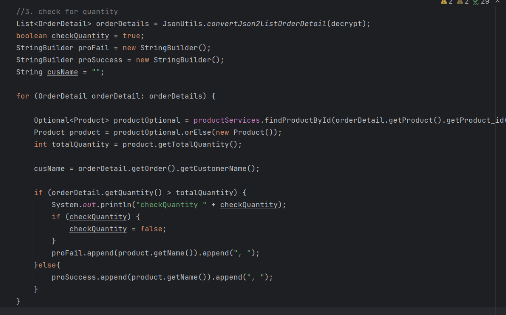

Đối với EmailService, tạo ra một đối tượng SimpleMailMessage rồi điền thông tin cho các field:

to: Địa chỉ email của người nhận.

subject: Chủ đề (tiêu đề) của email.

body: Nội dung của email.

Cuối cùng, nó sử dụng mailSender.send(message) để gửi email

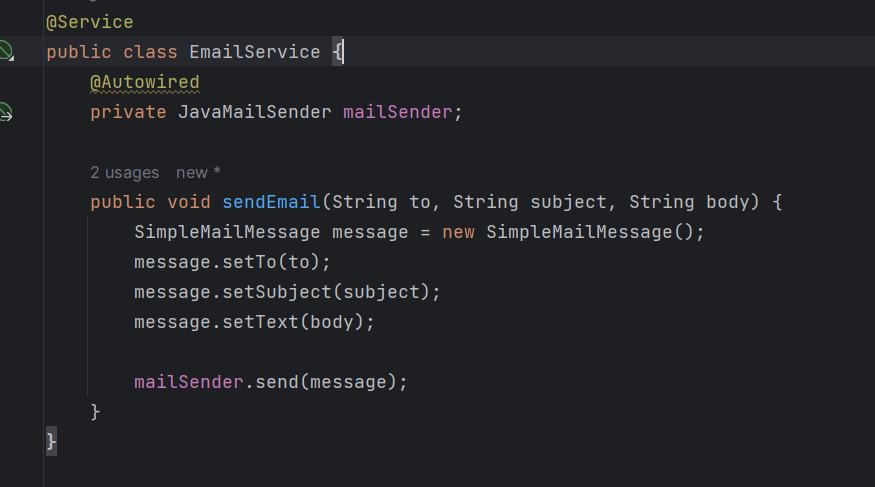

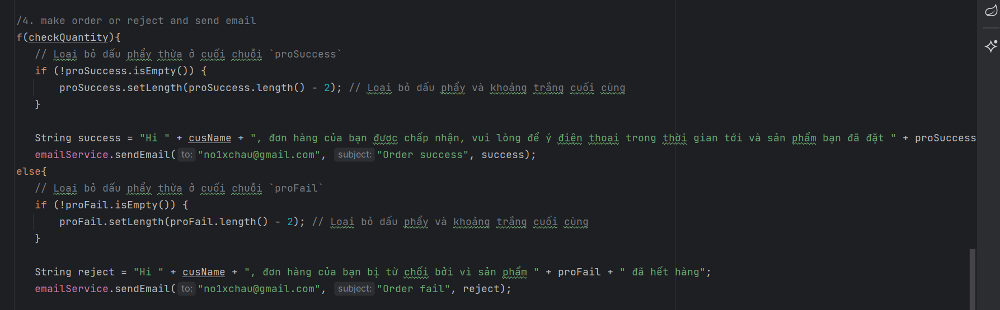

### Send Email
Thông báo order success với danh sách các sản phẩm đã đặt
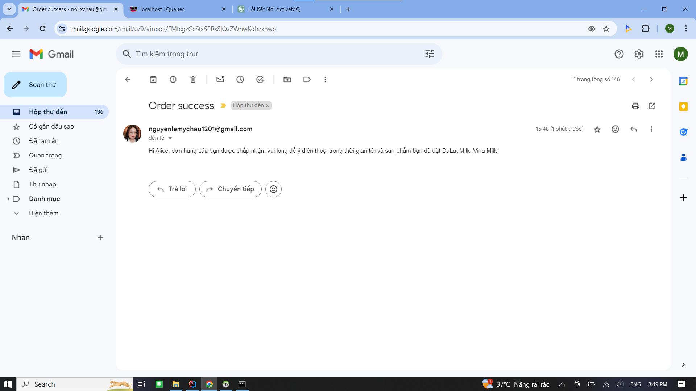

Thông báo order fail với danh sách các sản phẩm đã hết hàng cho khách hàng biết
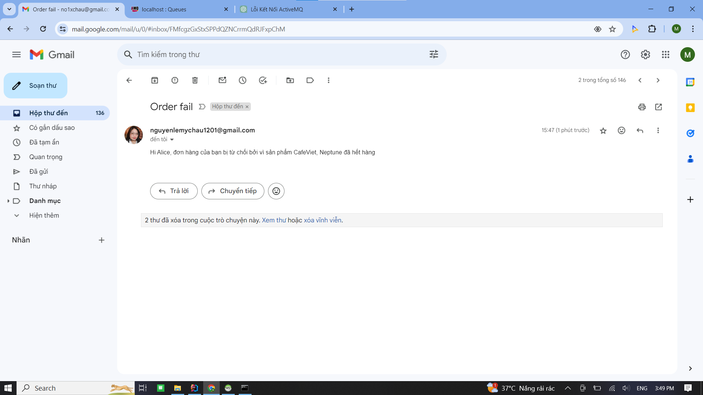

